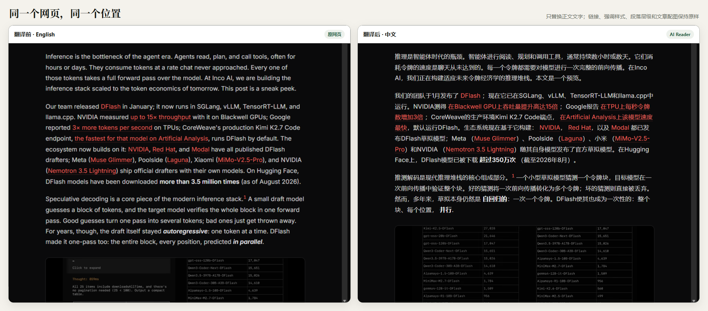
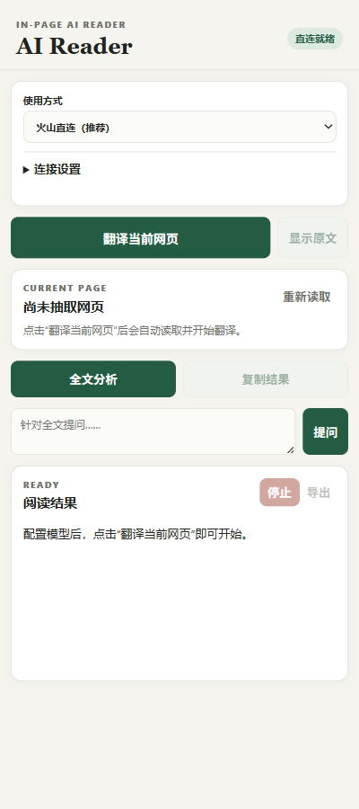
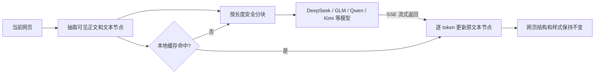

<div align="center">

# AI Reader

把英文网页直接翻译成中文，原来的排版不动。

<p>
  
  
  
  
</p>

</div>



## 为什么写这个扩展

我一直想要一个很具体的浏览器功能：打开一篇英文技术文章，不跳转到翻译页，不做左右双栏，也不重新排版，只把网页里的英文逐步换成中文。

Chrome 和 Edge 自带翻译很方便，普通网页基本够用。但一碰到大模型、推理框架和算子文章，效果就不太稳定。`speculative decoding`、`draft model`、`serving stack`、`kernel` 这类术语经常被译错，句子稍微长一点，技术关系也容易变味。

另一方面，我已经在用 DeepSeek、GLM、Qwen、Kimi 等模型，也有自己的 coding plan、token plan 或 OpenAI 兼容 API。如果能把这些模型接到浏览器里，技术文章的翻译会靠谱得多。AI Reader 就是从这个需求开始的。

它不重建网页。扩展找到正文中的原始文本节点，让模型逐段翻译，再把中文写回同一个节点。标题还是标题，链接仍然能点，粗体、列表、表格和深色主题也都留在原位。

## 实际效果

上面的左右截图来自 [Inco AI 的 DFlash 2 文章](https://inco.ai/blog/dflash2/)，使用相同的视口和正文位置。可以直接对照红色链接、粗体、斜体、段落层级以及下方的文章配图；AI Reader 只替换文字，没有改动网页结构：

- 英文按生成进度逐步变成中文，没翻到的部分继续显示英文；
- 链接、强调样式、段落间距和页面主题保持不变；
- 刷新或点击“显示原文”可以回到原始内容。

侧栏保持在网页旁边，不会盖住正文：

<p align="center">
  
</p>

## 它怎么工作



翻译协议要求模型为每个原始文本节点返回一份译文。内部标记会在写回网页前被解析和清理，不会出现在正文里。模型偶尔漏回节点时，扩展会自动补译一次；仍未返回的节点保留英文。

## 安装

AI Reader 暂时以解压缩扩展的方式安装，不需要构建。

1. 下载或克隆这个仓库。
2. 在 Edge 打开 `edge://extensions/`，Chrome 打开 `chrome://extensions/`。
3. 开启“开发人员模式”。
4. 点击“加载解压缩的扩展”，选择仓库根目录。
5. 打开普通 `http` 或 `https` 网页，点击工具栏中的 AI Reader。

更新代码后，在扩展管理页点击一次“重新加载”即可。

## 最简单的配置：直接连接模型 API

第一次使用时展开“连接设置”，填写 Base URL 和 API Key，然后点击“连接并读取模型”。

标准火山方舟地址：

```text
https://ark.cn-beijing.volces.com/api/v3
```

也可以使用任何兼容 OpenAI Chat Completions 的 HTTPS 地址。扩展会请求：

```text
POST {Base URL}/chat/completions
```

如果服务支持 `GET {Base URL}/models`，模型会自动出现在下拉框里。如果返回 404，侧栏会明确提醒，并切换到手动 Model ID。只需填写一次，之后会自动恢复。

Base URL、API Key 和选中的模型保存在当前浏览器扩展的 `chrome.storage.local` 中。这里不是加密保险箱，只适合自己的可信电脑。

## 翻译缓存和 Token

相同页面使用相同 Base URL 和模型再次翻译时，AI Reader 会直接读取本地译文缓存。只有新增或变化的文本才会发给模型。

翻译过程中，侧栏会显示本次输入、输出和总 Token：

```text
本次 Token：1,250 · 输入 820 · 输出 430 · 精确
缓存命中 35 段（不计入）
```

网关返回标准 `usage` 时显示精确值，否则显示动态估算值。缓存命中的部分不计入本次 Token；整页命中时总数为 0。

缓存默认开启，保存最近 20 个页面，总量限制在约 2 MB。可以在连接设置中关闭或清除缓存，API Key 和模型配置不会受影响。

## OpenCode 高级模式

如果模型已经配置在 OpenCode 中，可以在“使用方式”里切换到 OpenCode：

```text
地址：http://127.0.0.1:4096
用户名：opencode
服务密码：启动 OpenCode Server 时设置的密码
```

启动示例：

```powershell
$env:OPENCODE_SERVER_USERNAME = "opencode"
$env:OPENCODE_SERVER_PASSWORD = Read-Host "OpenCode server password"
opencode serve --hostname 127.0.0.1 --port 4096 --cors "chrome-extension://<extension-id>"
```

连接成功后，从 OpenCode 返回的 Provider 和 Model 列表中选择即可。OpenCode 密码只保存在 `chrome.storage.session`，浏览器会话结束后清除。

## 侧栏里的其他功能

| 功能 | 用途 |
| --- | --- |
| 翻译当前网页 | 自动读取正文，把译文流式写回原网页 |
| 显示原文 | 恢复本次读取时保存的英文 |
| 重新读取 | 页面内容变化后重新建立正文索引 |
| 全文分析 | 分块阅读全文，再生成中文分析 |
| 提问 | 只根据当前网页内容回答问题 |
| 停止 | 中止当前请求，未完成部分继续保持英文 |

## 当前边界

以下页面暂时不能或不适合处理：

- 浏览器内置页、扩展商店和受保护页面；
- PDF、跨域 iframe、Shadow DOM；
- 只渲染当前可见区域的超长虚拟列表。

单次正文上限为 60 万字符、5000 个内容块和 160 个模型分块。直连模式会自动缩小分块，避免长时间流式连接被网关关闭。

## 安全说明

- 只有用户点击操作后，扩展才读取当前标签页。
- API Key 不会注入网页、写入日志或导出文件。
- 网页正文始终按不可信数据处理，模型请求固定禁用工具调用。
- 火山直连只接受 HTTPS；OpenCode 地址固定为 `http://127.0.0.1:4096`。
- 译文缓存保存页面 URL、原文指纹和中文译文，不保存完整英文原文。敏感页面可以关闭缓存。

## 开发与测试

项目使用原生 JavaScript 和浏览器 API，没有打包步骤。测试需要 Node.js 20 或更高版本：

```powershell
npm test
npm run check
```

主要目录：

```text
manifest.json                 MV3 权限和 Side Panel 声明
src/content/page-bridge.js    正文抽取、文本节点替换、原文恢复
src/volcengine/client.js      OpenAI 兼容 Chat Completions 客户端
src/opencode/client.js        OpenCode 高级模式客户端
src/pipeline/                 分块、缓存、翻译协议和 Token 统计
src/sidepanel/                侧栏界面与任务编排
src/shared/                   安全边界和共享常量
tests/                        Node 内置测试
```

如果你也经常读英文技术文章，欢迎试用、提 issue，或者直接改成适合自己的模型入口。
